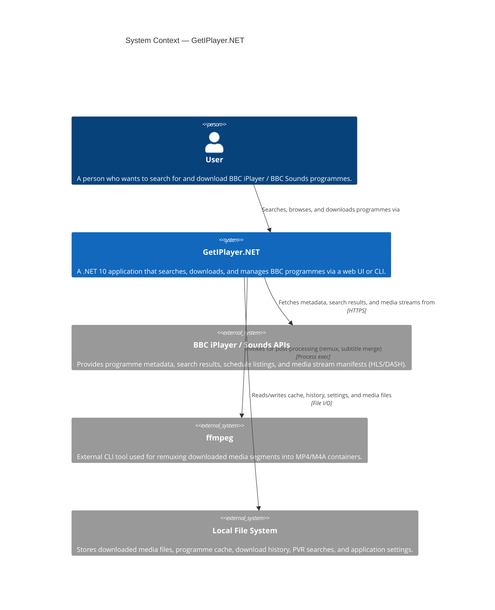

# C1 — System Context Diagram

The System Context diagram shows GetIPlayer.NET as a single system, the people who use it, and the external systems it interacts with.

## Key External Dependencies

| System | Purpose | Protocol |
|--------|---------|----------|
| **BBC iPlayer / Sounds APIs** | Programme search (`ibl` JSON API), metadata (programmes pages), stream discovery (playlist JSON), schedule listings | HTTPS to `www.bbc.co.uk` |
| **ffmpeg** | Remuxes raw HLS/DASH segment files into final MP4/M4A, optionally merges subtitles | Local process execution |
| **Local File System** | Persists JSON cache, download history, PVR saved searches, options, and the final media output | File I/O |

## Actors

| Actor | Description |
|-------|-------------|
| **User** | Interacts through the Razor Pages web UI (browser) or the CLI (`System.CommandLine`-based) |
