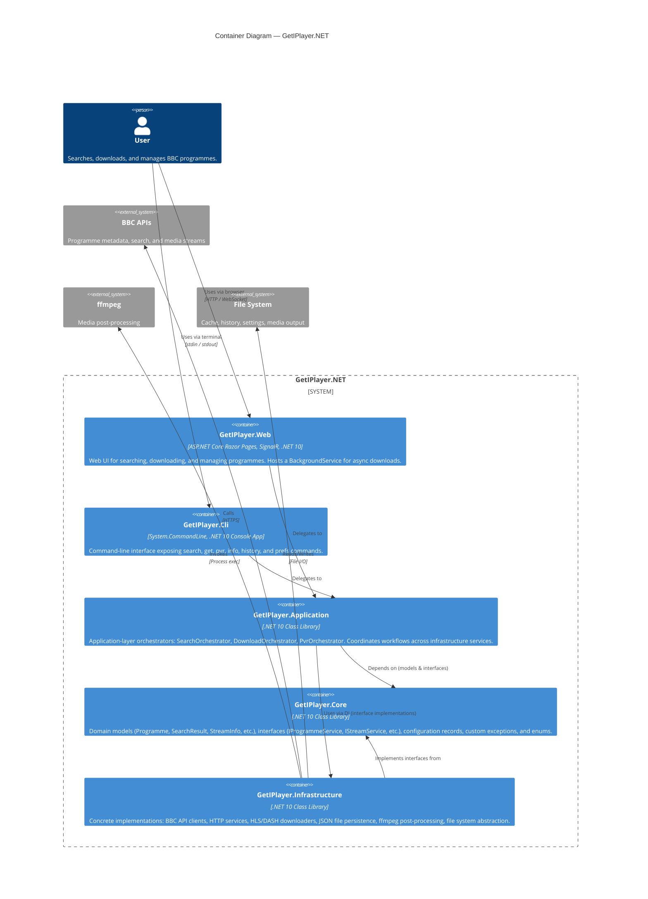

# C2 — Container Diagram

The Container diagram zooms into the GetIPlayer.NET system to show the major deployable / runnable units and their relationships.



## Container Descriptions

### GetIPlayer.Web (`GetIPlayer.Web.csproj`)

| Aspect | Detail |
|--------|--------|
| **Type** | ASP.NET Core Razor Pages application |
| **Pages** | `Index`, `Search`, `Programme`, `Download`, `History/Index`, `Pvr/Index`, `Pvr/Add`, `Settings`, `Error` |
| **Real-time** | `DownloadHub` (SignalR) broadcasts download progress to connected browsers |
| **Background** | `DownloadBackgroundService` reads from a `Channel<DownloadRequest>` queue and processes downloads sequentially |
| **State** | `DownloadTracker` (in-memory `ConcurrentDictionary`) tracks active/completed downloads |

### GetIPlayer.Cli (`GetIPlayer.Cli.csproj`)

| Aspect | Detail |
|--------|--------|
| **Type** | Console application using `System.CommandLine` |
| **Commands** | `search`, `get`, `info`, `pvr`, `history`, `refresh`, `prefs` |
| **DI** | Builds its own `ServiceCollection` with the same `AddGetIPlayerServices()` extension |

### GetIPlayer.Application (`GetIPlayer.Application.csproj`)

| Aspect | Detail |
|--------|--------|
| **Orchestrators** | `SearchOrchestrator`, `DownloadOrchestrator`, `PvrOrchestrator` |
| **Role** | Application-layer use-case coordinators; no direct dependency on concrete infrastructure |

### GetIPlayer.Core (`GetIPlayer.Core.csproj`)

| Aspect | Detail |
|--------|--------|
| **Models** | `Programme`, `SearchResult`, `StreamInfo`, `StreamVersion`, `DownloadResult`, `DownloadProgress`, `HistoryRecord`, `PvrSearch`, `ChannelInfo`, `TagMetadata`, `SubtitleData` |
| **Interfaces** | `IProgrammeService`, `IStreamService`, `IDownloadService`, `ICacheService`, `IHistoryService`, `IPvrService`, `IHttpClientService`, `IHlsDownloader`, `IDashDownloader`, `IPostProcessor`, `ISubtitleService`, `IFileSystem`, `IExternalProcessRunner` |
| **Configuration** | `AppSettings`, `DownloadOptions`, `OutputOptions`, `ProxySettings` |
| **Exceptions** | `GetIPlayerException`, `GeoBlockedException`, `ProgrammeNotFoundException`, `StreamUnavailableException`, `DownloadFailedException`, `ValidationException` |
| **Enums** | `ProgrammeType`, `QualityLevel`, `DownloadStatus`, `StreamProtocol` |

### GetIPlayer.Infrastructure (`GetIPlayer.Infrastructure.csproj`)

| Aspect | Detail |
|--------|--------|
| **BBC** | `BbcProgrammeService`, `BbcStreamService`, `MetadataParser`, `UrlBuilder`, `PidValidator` |
| **HTTP** | `BbcHttpClientService`, `UserAgentProvider`, `ProxyHandler` |
| **Streaming** | `HlsDownloader`, `DashDownloader`, `SegmentDownloader`, `M3u8Parser`, `MpdParser` |
| **Persistence** | `JsonCacheService`, `JsonHistoryService`, `PvrFileService`, `OptionsFileService`, `LockFileService` |
| **Post-processing** | `FfmpegProcessor`, `SubtitleConverter`, `ThumbnailDownloader` |
| **File System** | `SafeFileSystem`, `FileNamingService`, `SafeProcessRunner` |
| **DI** | `ServiceCollectionExtensions.AddGetIPlayerServices()` wires everything up |

## Dependency Direction

```
Web / Cli  →  Application  →  Core (interfaces & models)
                  ↕
             Infrastructure  →  Core (implements interfaces)
```

Both host projects (`Web`, `Cli`) reference `Application` and `Infrastructure`. `Application` and `Infrastructure` both reference `Core`. `Infrastructure` never references `Application`.
