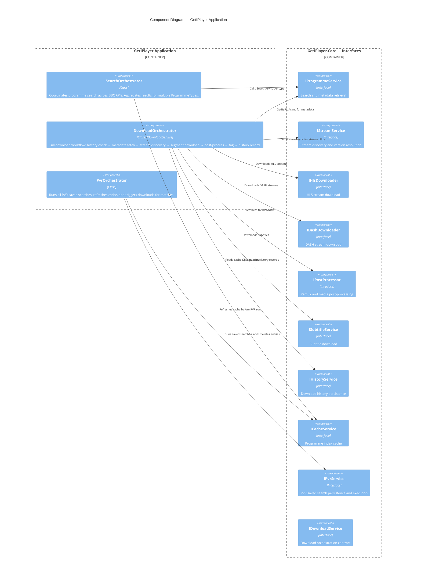
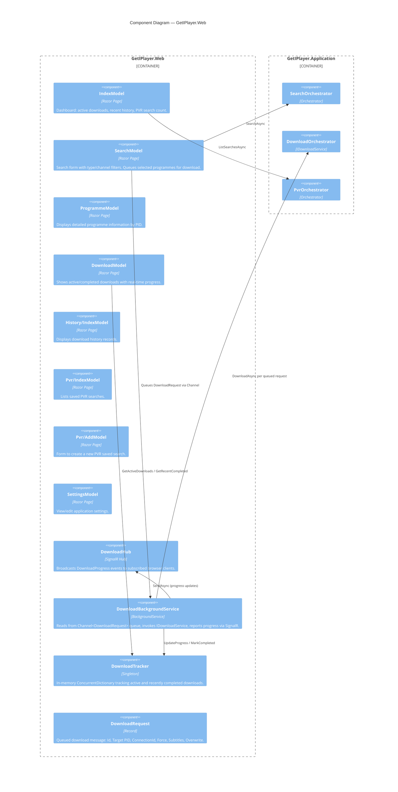
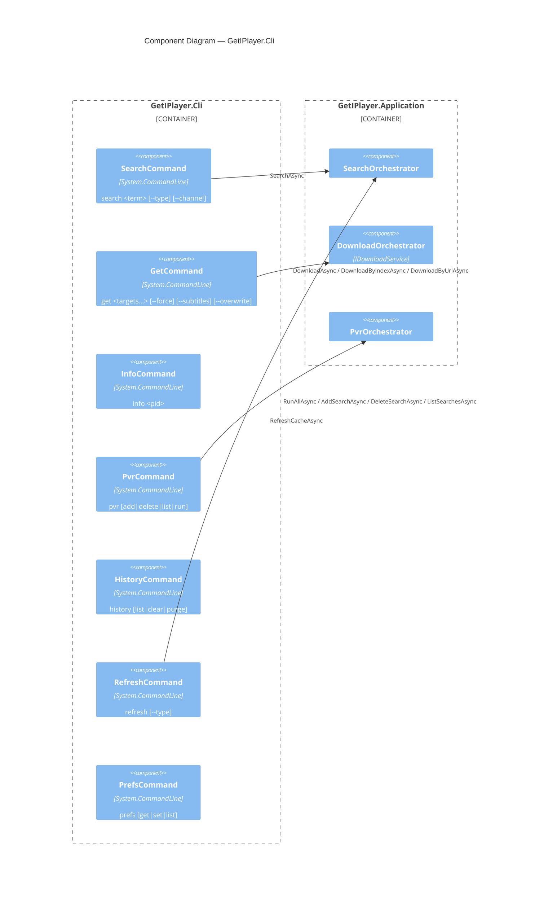

# C3 — Component Diagram

The Component diagram zooms into each container to show the major classes/components and their interactions.

## Application Layer Components

## Infrastructure Layer Components

```mermaid
C4Component
    title Component Diagram — GetIPlayer.Infrastructure

    Container_Boundary(infra, "GetIPlayer.Infrastructure") {

        Component(bbcProg, "BbcProgrammeService", "IProgrammeService", "Fetches programme metadata and search results from BBC JSON APIs. Uses UrlBuilder and MetadataParser.")
        Component(bbcStream, "BbcStreamService", "IStreamService", "Discovers HLS/DASH stream URLs via playlist.json. Resolves versions and quality levels.")
        Component(urlBuilder, "UrlBuilder", "Static", "Constructs BBC API URLs with safe escaping. OWASP A10 compliant.")
        Component(metaParser, "MetadataParser", "Class", "Parses JSON responses from BBC APIs into Programme domain models.")
        Component(pidValidator, "PidValidator", "Static", "Validates BBC PIDs match expected format (alphanumeric, 8+ chars).")

        Component(httpClient, "BbcHttpClientService", "IHttpClientService", "HTTP client with TLS enforcement, URL domain validation, user-agent rotation.")
        Component(uaProvider, "UserAgentProvider", "Class", "Rotates browser-like User-Agent strings.")
        Component(proxyHandler, "ProxyHandler", "Static", "Configures HTTP proxy on HttpClientHandler.")

        Component(hlsDl, "HlsDownloader", "IHlsDownloader", "Parses M3U8 master/media playlists, downloads TS segments, concatenates output.")
        Component(dashDl, "DashDownloader", "IDashDownloader", "Parses MPD manifests, downloads DASH segments, concatenates output.")
        Component(segDl, "SegmentDownloader", "Class", "Shared concurrent segment downloader used by both HLS and DASH downloaders.")
        Component(m3u8, "M3u8Parser", "Static", "Parses HLS M3U8 playlists into variant/segment lists.")
        Component(mpd, "MpdParser", "Static", "Parses MPEG-DASH MPD manifests into adaptation set/segment lists.")

        Component(jsonCache, "JsonCacheService", "ICacheService", "JSON file-based programme listing cache with TTL-based expiry.")
        Component(jsonHist, "JsonHistoryService", "IHistoryService", "JSON file-based download history with file-level locking.")
        Component(pvrFile, "PvrFileService", "IPvrService", "One-JSON-file-per-search PVR persistence. Runs searches against cache and triggers downloads.")
        Component(optionsFile, "OptionsFileService", "Class", "Loads/saves AppSettings from options.json.")
        Component(lockFile, "LockFileService", "Class", "Prevents concurrent get_iplayer instances via lock files.")

        Component(ffmpeg, "FfmpegProcessor", "IPostProcessor", "Invokes ffmpeg via SafeProcessRunner for remux, subtitle merge, audio extraction.")
        Component(subConv, "SubtitleConverter", "Class", "Converts BBC subtitle formats (TTML) to SRT.")
        Component(thumbDl, "ThumbnailDownloader", "Class", "Downloads programme thumbnail images for tagging.")

        Component(safeFs, "SafeFileSystem", "IFileSystem", "Safe file operations with path traversal protection.")
        Component(naming, "FileNamingService", "Class", "Generates output filenames from templates and programme metadata.")
        Component(safeProc, "SafeProcessRunner", "IExternalProcessRunner", "Executes external processes with argument sanitisation. OWASP A03 compliant.")
    }

    Rel(bbcProg, urlBuilder, "Builds URLs")
    Rel(bbcProg, metaParser, "Parses responses")
    Rel(bbcProg, httpClient, "Fetches JSON")
    Rel(bbcProg, pidValidator, "Validates PIDs")
    Rel(bbcStream, urlBuilder, "Builds playlist URLs")
    Rel(bbcStream, httpClient, "Fetches playlist JSON")
    Rel(hlsDl, m3u8, "Parses M3U8")
    Rel(hlsDl, segDl, "Downloads segments")
    Rel(dashDl, mpd, "Parses MPD")
    Rel(dashDl, segDl, "Downloads segments")
    Rel(segDl, httpClient, "HTTP GET segments")
    Rel(ffmpeg, safeProc, "Executes ffmpeg")
    Rel(pvrFile, jsonCache, "Reads cached programmes")
```

## Web Container Components

## CLI Container Components

