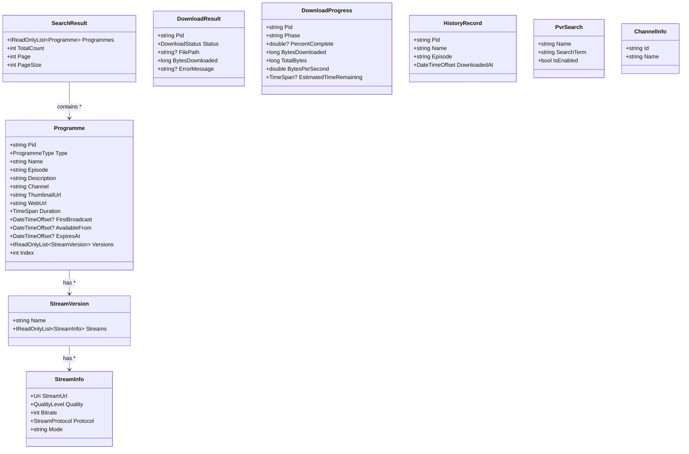
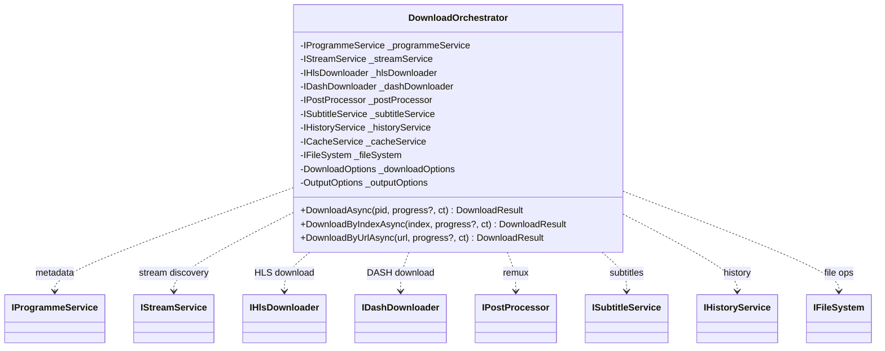
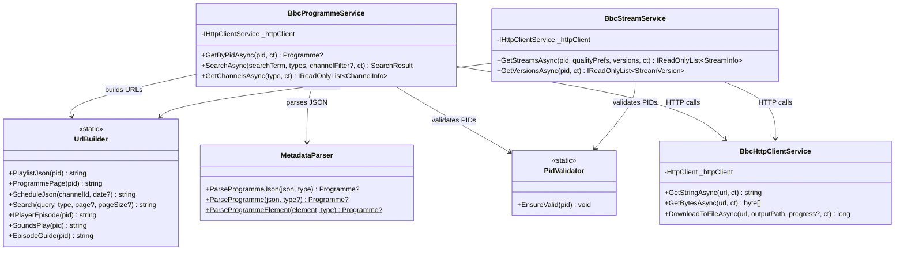

# C4 — Code-Level Diagrams

This level zooms into key classes and their relationships for the most important workflows.

## Core Domain Model

## Core Interfaces

```mermaid
classDiagram
    class IProgrammeService {
        <<interface>>
        +SearchAsync(searchTerm, types, channelFilter?, ct) SearchResult
        +GetByPidAsync(pid, ct) Programme?
        +GetChannelsAsync(type, ct) IReadOnlyList~ChannelInfo~
    }

    class IStreamService {
        <<interface>>
        +GetStreamsAsync(pid, qualityPrefs, versions, ct) IReadOnlyList~StreamInfo~
        +GetVersionsAsync(pid, ct) IReadOnlyList~StreamVersion~
    }

    class IDownloadService {
        <<interface>>
        +DownloadAsync(pid, progress?, ct) DownloadResult
        +DownloadByIndexAsync(index, progress?, ct) DownloadResult
        +DownloadByUrlAsync(url, progress?, ct) DownloadResult
    }

    class ICacheService {
        <<interface>>
        +GetAllAsync(type, ct) IReadOnlyList~Programme~
        +RefreshAsync(type, ct) void
    }

    class IHistoryService {
        <<interface>>
        +ExistsAsync(pid, ct) bool
        +AddAsync(record, ct) void
        +GetAllAsync(ct) IReadOnlyList~HistoryRecord~
    }

    class IPvrService {
        <<interface>>
        +RunAsync(progress?, ct) IReadOnlyList~DownloadResult~
        +AddAsync(search, ct) void
        +DeleteAsync(name, ct) void
        +GetAllAsync(ct) IReadOnlyList~PvrSearch~
    }

    class IHttpClientService {
        <<interface>>
        +GetStringAsync(url, ct) string
        +GetBytesAsync(url, ct) byte[]
        +DownloadToFileAsync(url, outputPath, progress?, ct) long
    }

    class IHlsDownloader {
        <<interface>>
        +DownloadAsync(stream, outputPath, progress?, ct) long
    }

    class IDashDownloader {
        <<interface>>
        +DownloadAsync(stream, outputPath, progress?, ct) long
    }

    class IPostProcessor {
        <<interface>>
        +RemuxAsync(inputPath, outputPath, subtitlePath?, ct) void
    }

    class IFileSystem {
        <<interface>>
        +FileExists(path) bool
        +CreateDirectory(path) void
        +ReadAllTextAsync(path, ct) string
        +WriteAllTextAsync(path, content, ct) void
    }

    class IExternalProcessRunner {
        <<interface>>
        +FindExecutable(name) string?
        +RunAsync(executable, args, ct) int
    }
```

## DownloadOrchestrator — Internal Workflow

## BBC Infrastructure — Class Relationships

