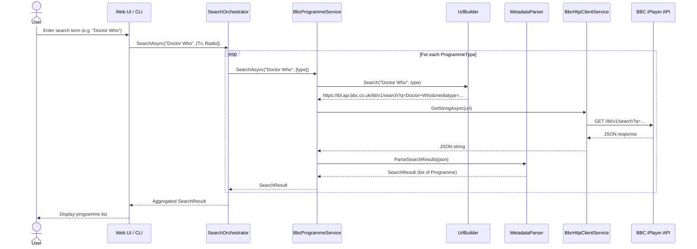
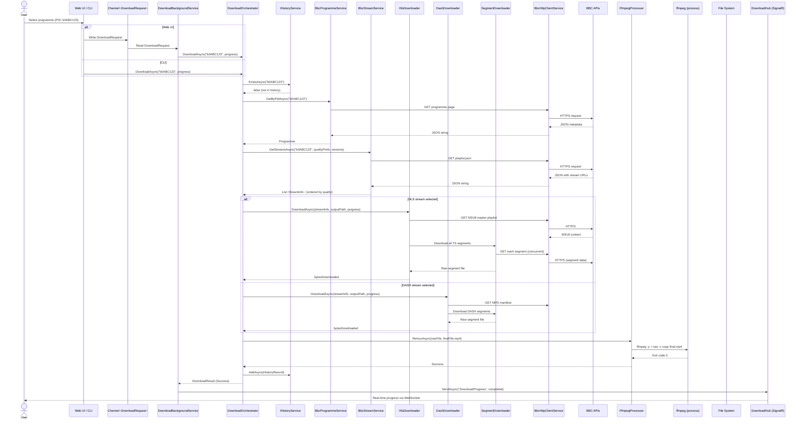
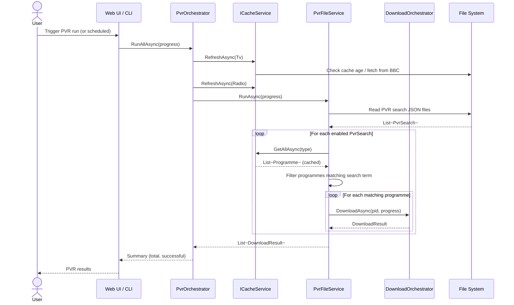

# Data Flow Diagrams

End-to-end data flows for the three primary use cases.

---

## 1. Search Flow

The user searches for a BBC programme by keyword. Results are fetched from the BBC iPlayer search API in real time.

### Key Details

- The `SearchOrchestrator` iterates over requested `ProgrammeType[]` (TV, Radio) and calls `BbcProgrammeService.SearchAsync` for each
- `UrlBuilder.Search()` constructs the BBC ibl JSON API URL with safe URI escaping
- `MetadataParser` converts raw JSON into `Programme` domain records
- Optional `channelFilter` is applied as a post-filter on the aggregated results
- Input is validated: search term is truncated at 200 characters in the web UI

---

## 2. Download Flow

The user initiates a download for a programme by PID. The system discovers streams, downloads segments, post-processes, and records history.

### Key Details

- **Web path**: Download requests go through a `Channel<DownloadRequest>` → `DownloadBackgroundService` → `DownloadOrchestrator`
- **CLI path**: The CLI calls `DownloadOrchestrator` directly
- **History check**: Downloads are skipped if the PID is already in history (unless `--force` is used)
- **Stream selection**: Streams are sorted by quality preference, then by bitrate (descending)
- **Segment download**: `SegmentDownloader` handles concurrent segment downloads with configurable parallelism
- **Post-processing**: `FfmpegProcessor` remuxes raw segments into MP4/M4A via `SafeProcessRunner` (no shell injection)
- **Progress reporting**: The web UI receives real-time updates through SignalR (`DownloadHub`)

---

## 3. PVR (Automated Recording) Flow

The PVR system runs saved searches against the programme cache and automatically downloads new matches.

### Key Details

- Cache is always refreshed before a PVR run to ensure the latest listings are available
- Each `PvrSearch` is stored as a separate JSON file in the PVR directory
- Only enabled searches (`IsEnabled == true`) are executed
- Matching uses the search term against the cached programme list
- Downloads go through the same `DownloadOrchestrator` pipeline as manual downloads
